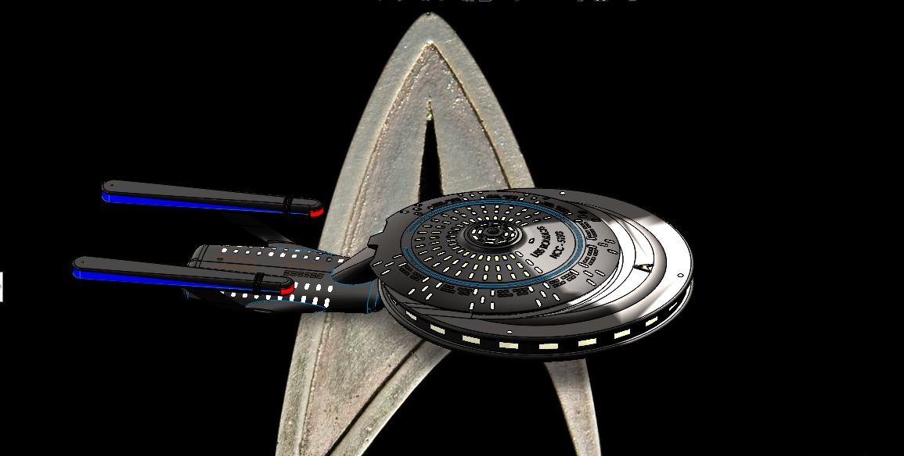

# Starship CAD Project 🚀🛠️

[](#)
[](#)
[](LICENSE)


[](https://github.com/blaketjohnson)

A **parametric SolidWorks CAD project** designed for **AME 5193: Intro to Computer-Aided Design (Spring 2025)**.  
The project involved building a **Starship-inspired assembly** from the ground up, emphasizing subsystem integration, parametric modeling, and presentation-quality visualization.

---

## ✨ Highlights for Recruiters
- Full **SolidWorks assembly** with parametric parts and mating constraints.  
- Produced **STEP/STL exports** for cross-platform compatibility.  
- Generated **high-resolution renders** for technical presentation and reports.  
- Delivered a structured repo with **CAD source, exports, documentation, and renders**.  
- Demonstrates **CAD modeling, design communication, and portfolio presentation skills**.

---

## 📽️ Project Walkthrough Video
▶️ [Watch the full design walkthrough on YouTube](https://youtu.be/Q1W1udKvBcU)

---

## 🖼️ Preview Renders
<p align="center">
  
  
</p>

<p align="center">
  
  
</p>

---

## 📂 Repository Structure
```
starship-cad-project/
├── cad/             # SolidWorks source files (.SLDASM, .SLDPRT)
├── exports/         # Neutral CAD exports (STEP, STL)
├── renders/         # High-quality renders (PNG)
├── docs/            # Project documentation (PDF design summary)
├── paper/           # Original course report deliverables
└── README.md        # This file
```

---

## 🛠️ Tools Used
- **SolidWorks 2024** — parametric CAD, assemblies, constraints, rendering  
- **LaTeX** — technical report and documentation  
- **Git/GitHub** — version control, repo organization  

---

## 📌 About the Author
This project is part of a portfolio in **orbital mechanics, mission design, and aerospace systems engineering**, including applications of CAD to aerospace structures.  
More projects available at: [GitHub Portfolio](https://github.com/blaketjohnson)

---

## 📜 License
MIT License — see [LICENSE](LICENSE).
